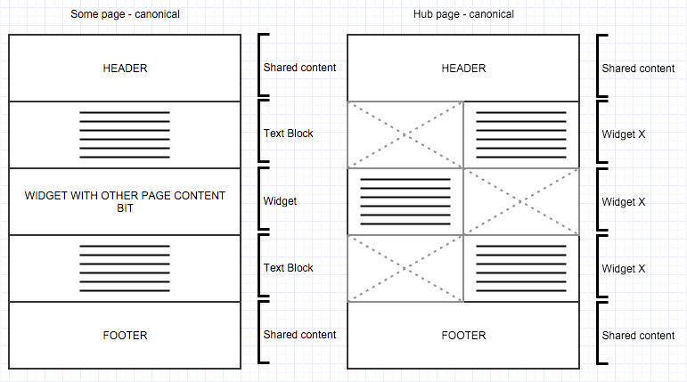
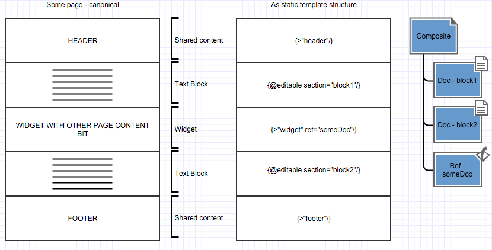
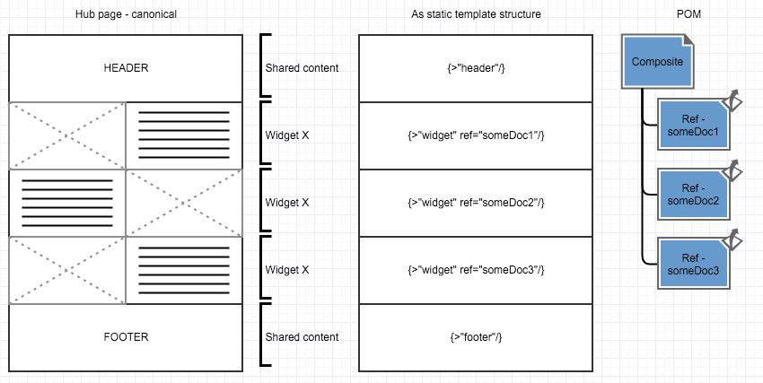
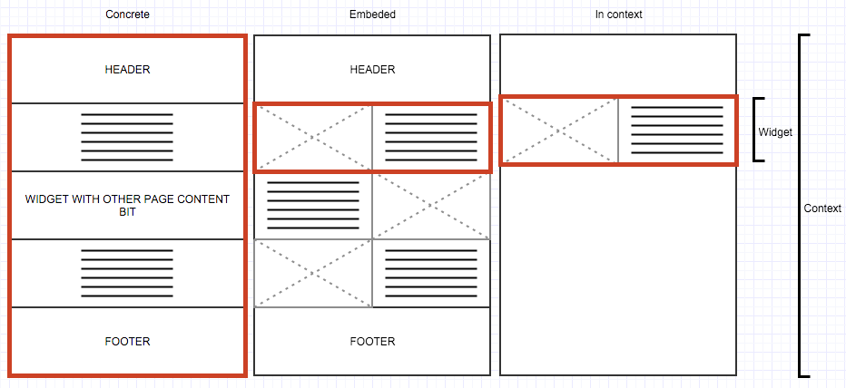

# Lackey


_Version 0.1.0_

Lackey is __Best Practice Driven CMS__

 * Responsive First, FOSS, JS Front & Backend (Node.js)
 * Unique WYSIWAG : What You See is What you Actually Get content management UI
 * CSS/JS framework independent
 * Specification driven
 * Modular
 
It's just an awesome Node.js CMS and framework by  _Enigma_.

<!-- RM-IGNORE -->
## Table of Contents
<!-- /RM-IGNORE -->
<!-- RM(tree:*,depth:2) -->

* [Glossary](#glossary)
  * [Basics](#basics)
  * [UI/UX Structure](#uiux-structure)
  * [Page Composition](#page-composition)
  * [Default, Canonical, Embedded and in Variant](#default-canonical-embedded-and-in-variant)
  * [Taxonomy](#taxonomy)
* [Lackey is](#lackey-is)
  * [Responsive First](#responsive-first)
  * [CSS/JS framework independent](#cssjs-framework-independent)
  * [WYSIWAG - What You See is What you Actually Get](#WYSIWAG---What You See is What you Actually Get)
  * [Modular](#modular)
  * [Specification driven](#specification-driven)
* [Quick Start](#quick-start)
* [Coding practices](#coding-practices)
  * [TDD - Test Driven Development](#tdd---test-driven-development)
  * [Lint](#lint)
* [Quick start](#quick-start)
****

* [Documentation](./docs)
  * [API Reference](./docs/reference)
  * [Changelog](./docs/CHANGELOG.md)
  * [Examples](./docs/examples)
* [Modules](./modules)
  * [cms](./modules/cms)
  * [core](./modules/core)
  * [i18n](./modules/i18n)
  * [media](./modules/media)
  * [users](./modules/users)


<!-- /RM -->

## Glossary

To unify the way we work on the project we need to settle basic glossary we use in it. This glossary may differ in end user documentation. We will build up this glossary throughout examples and index it / HTML scaffold it later on. Each term (except in table) will be highlighted in **bold**.

### Basics

Term         | Description  | Example
------------ | ------------ | ----------
Website      | Specific service accessible under specific domain | i.e. `https://lackey.io`
Route        | Path part of request [URL](https://en.wikipedia.org/wiki/Uniform_Resource_Locator) without file extension. | In `https://lackey.io/about.html?q=text#fragment` is `/about`
Page         | What user see when he enters specific URL | i.e. `GET https://lackey.io/about.html`
Static Page  | Page that is defined by code.
Content      | Information stored in database, that describe **Page**. (We introduce that term to not conflict with **Page**)

In this part of documentation we are interested in **Content**. **Static Pages** are explained in the API Reference.

> **Content** contain information that fully bellongs to it.
>
>  * Direct content
>  * Own structure
>  * References to other **Content**
>
> **Page** can present information that is composed from various **Contents**

### UI/UX Structure

For our examples we will use two types of **Pages**.

 * Some **Page** - like blog post, article, contact page
 * Hub **Page** - listing page, composite site



Term                 | Description  | Example
-------------------- | ------------ | --------
Block                | UI Element that **page** is build of |
Text Block           | Block that can be edited using ProseMirror | Editable area
Shared Block         | Block that present other **Content** - embedded **content** decide about how it's presented. See also explanation in [Page Composition](#Page Composition)| Header, footer
Abstract Block        | Block that present other **Content** - block decide how to show embedded **content** | Carousel, page list, preview

### Page Composition

Both **Page** and **Abstract Block** share the same contcept of composition:

```
What You See = Data + Mapping + Format
Page = Content + Template + DUST Template
Abstract Block (embedded Content) = (Referred Content + Local Content Settings) + Abstract Block Definition + DUST Template
Abstract Block (local Content) = Local Content + Abstract Block Definition + DUST Template
Shared Block = Shared Content + Shared Block Defifition + DUST Template
```

Where

 * Data - contains information, i.e. **Variant**, **POM Object**, **Shared Block**
 * Mapping - tells how to compose result, i.e. **Template**, **Abstract Block Definition**, **Variant**
 * Format - shows how to expose result, i.e. **DUST Template**

Term                       | Description
-------------------------- | --------------------
Template                   | Information in database that tells how to compose **Page** (or **Abstract Block**). Contains information about what **DUST Template** we use, what styles and what JavaScripts.
DUST Template              | [DUST.js](http://dustjs.com) file that is used to produce HTML output.
Abstract Block Definition  | Kind of **Template** used to compose **Abstract Block**
Shared Block Definition    | Kind of **Template** used to compose **Shared Block**
Shared Content             | Kind of **Content** that can't be exposed by public **Route**. Used to compose **Shared Content**

In out example:





### Default, Canonical, Embedded and in Variant



Term                 | Description          | Example
-------------------- | -------------------- | ----------------------
Canonical            | Main **Route** to specific **Page**.
Default              | **Page** that most presicelly present specific **Content**. Always linked with **Canonical**, but can be referred by other **Routes**
Embedded              | Some **Content** exposed in **Page** representing other **Content** | For instance **Abstract Block**, **Shared Content**
Variant              | Emulates variants of **Content** presentation. In reality it's a **Template** that **embeds** ONE **Abstract Block** | View how **Page** will look as a hub page abstract Block or as posted on Facebook

### Taxonomy

> In Lackey; everything is a **Page**,
>
> but sometimes it's a blog post, article, hub page, tagged or categorised **Page**

Term                 | Description       | Example
-------------------- | ----------------- | --------
Taxonomy             | Information in database that groups associated **Pages**
Taxonomy Group       | Group of values used as taxonomy | tag, category, page type
Taxonomy Filter      | (planned for future) mechanism that allows to restrict specific **Templates** (so also **Abstract Blocks** and **Templates**) to specific taxonomy | i.e. only blog posts can be viewed as `blog post small abstract block`


## Lackey is...

### Responsive First

Lackey is completely designed from the ground up to support advanced Responsive/Fluid/Elastic design. 

It enables either the typical modern approach of 'DOM parity' (whereby all client recieve the same HTML/CSS and the User sees different *stuff* based on Media Query) and/or distinct structural models & views e.g for instances where you require unique DOM for certain entities e.g a SmartTV/Watch App etc...

Even the editing mode works on mobile. At the moment this is not well tested as all our current use cases only demand *view responsive but edit on desktop* but all design/UX/architectural decisions have been planned around supporting mobile editing and we fully expect to stabilise this in the future.

Lackey considers Responsive *flow order* (i.e. for any given block which shares a *row*; what is the vertical order of those blocks if/when collapsed on a smaller viewport) to be the responsibility of a template author and does not expose this to the CMS. You could if you wanted though, hit us up @GetLackey if this interests you.

### CSS/JS framework independent

Lackey frontend is based on Vanillas JS and CSS. JS is deployed using browserify and require. We try to not polute `window`. Actually we load into it things that __HAVE TO__ exist in your page DOM. While you are editing it, all controls, code and logic that are not required to exist in the scope of your page are embedded in the parent window and your page is rendered within an iframe.

Lackey doesn't use any framework that would conflict with others. Just please don't use PrototypeJS or other kits that change behaviour of native objects.

Also Lackey does not use `id` of `class` attributes. We use our own, namespaced `data-lky-*` attributes and strictly where we need them.

Feel free to use any CSS and JS framework you want on your page. Our JS __WON'T__ be deployed to your pages in non-edit mode as long you don't require it!

### WYSIWAG - What You See Is What you Actually Get

Most so called WYSYWIG (What You See Is What You Get) editors, do not display an accurate rendering of the final content.

They also tend to have 2 separate EDIT & VIEW states, slowing down content management and failing to provide design rules in context to 

When you're editing visual content e.g. a standard HTML page in Lackey, the UI does not have independent EDIT & VIEW states. 

The rendered HTML you sou see is identical to what will be seen by end users. Achieving accuracy in the reproduction of web fonts, spacing etc... was one of the main reasons we decided

If you're looking at *abstract data* e.g. lists of Users or Tags, a default UI is provided which currently uses Angular JS (Not 2.x branch so no TypeScript required) so we can leverage the ng-grid component for convenient searchable, sortable tabular data. We'll probbaly remove the Angular dependency and build our own one of these at some point but it suffices for the time being.

### Modular

Discrete modules are available through NPM where isolation is appropriate.

### Specification driven

Lackey uses PostgreSQL although we're trying to keep everything as database agnostic as we can (previous incarnations of Lackey used MongoDB for example). Perhaps in the future if our use cases expand or the community desires, we will provide a choice. You never know! As a result, we keep the way in which we describe data independent from the data provider and use the DDD (Domain Driven Development) pattern to organise it.

Lackey can be scaffolded using _Lackey Module YAML_ which we introduced primarily for these reasons:

1.) Most pages of a site will come with initialisation data you'll want to version control. 

2.) There are instances e.g. where you want to transfer site state across environments e.g Local>Staging>QA>Production without dropping/importing the database. 

3.) Version controlled content/behaviour specifications are great for business too! Technically adept manager types can use Lackey to generate SOW (Statement Of Work) documentation from a declarative YAML description prior to further development time being committed against that spec which reduces wasted/unbillable depending on your business domain.


YAML is machine and human readable text format that represent data. The structure of data within it is closely bound to the application it's used in. It can be easily sanitised, processed and validated. For Developers, it creates a aafe format to exchange data. 

Lackey Module YAML allows you to define/amend:

 * Site/module meta data
 * Roles and permissions
 * Default user accounts
 * Templates and Variants
 * Contents (i.e. pages) including text content

Lackey Module YAML fully uses powers of our _POM_ and human friendly text format [Markdown](https://daringfireball.net/projects/markdown/). We do all magic behind scene to assemble it back to working site.

For milestone 1.0.0 we planned YAML dumps.

```yaml
to refresh
```
## Quick Start

```sh
npm i -g lackey-cms
lackey project create
cd {project-name}
npm i
lackey site run
```


## Coding practices

### TDD - Test Driven Development
 * Test define use case
 * Test is reference and documentation
 * Test keeps status quo
 * Test help maintain continour integration
 * Test has to cover all files, except:
   * Handling errors that other files are responsible for

### Lint

 * Eslint `gulp lint`
 
 N.B Enigma use [Brackets](https://brackets.io) and recommend [https://github.com/slai/brackets-yaml-linter](https://github.com/slai/brackets-yaml-linter) when editing Lackey Module YAML; and any .yml files in general.

## Quick start

Install Lackey

`npm i --save git@bitbucket.org:enigmamarketingdigital/enigma-15894-lackey.git`

Create project config file `lackey.json`. It can be empty for now:

```javascript
{}
```

Run site

```sh
./node_modules/lackey-cms-2/bin/lackey site run --site default
```

# License and Credits

Get Involved on [GitHub](https://github.com/getlackey) or Follow [@getlackey](https://twitter.com/GetLackey) on twitter.

Code licensed under [Apache License v2.0](http://www.apache.org/licenses/LICENSE-2.0)

Open sourced by Enigma 
