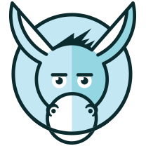

# Lackey

_Version 0.2.6

Lackey is __Best Practice Driven CMS__

 * Responsive First, FOSS, JS Front & Backend (Node.js)
 * Unique WYSIWAG : What You See is What you Actually Get content management UI
 * CSS/JS framework independent
 * Specification driven
 * Modular

It's just an awesome Node.js CMS and framework by  _Enigma_.

 * [Documentation](https://github.com/getlackey/lackey-cms/wiki)
 * [Boilerplate](https://github.com/getlackey/boilerplate)
 * [API Reference](http://getlackey.github.io/lackey-cms) - only for core development

# License and Credits

Get Involved on [GitHub](https://github.com/getlackey) or Follow [@getlackey](https://twitter.com/GetLackey) on twitter.

Code licensed under [Apache License v2.0](http://www.apache.org/licenses/LICENSE-2.0)

Open sourced by Enigma 
